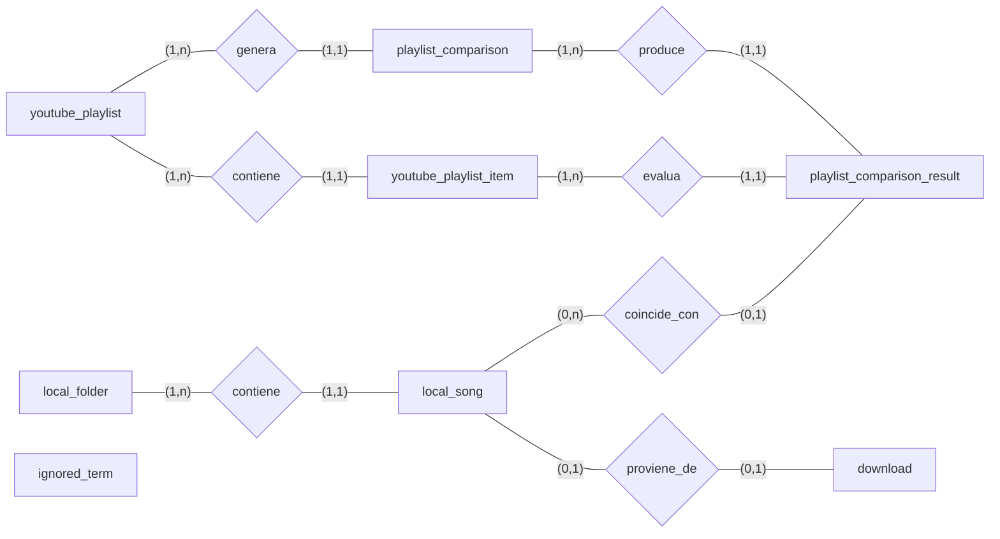

# Modelo Entidad-Relacion

## Objetivo

Este modelo entidad-relacion representa la base conceptual de la aplicacion.

Punto clave del dominio:

* no existen playlists locales
* la playlist vive en YouTube
* la biblioteca local vive en una carpeta de musica
* la carpeta local seleccionada por el usuario es la fuente de las canciones locales
* la app compara la playlist de YouTube contra las canciones locales
* las comparaciones deben poder guardarse
* el objetivo principal es detectar canciones de la playlist que todavia no existen en local
* en la carpeta local no debe haber canciones repetidas

## Diagrama Mermaid

`ignored_term` queda aislada en esta fase porque actua como soporte configurable del proceso de normalizacion y matching.

## Entidades

* `local_folder`
* `local_song`
* `youtube_playlist`
* `youtube_playlist_item`
* `playlist_comparison`
* `playlist_comparison_result`
* `download`
* `ignored_term`

## Relaciones y cardinalidades

### `youtube_playlist` contiene `youtube_playlist_item`

* `youtube_playlist (1,n) <-> youtube_playlist_item (1,1)`

Una playlist de YouTube contiene muchos items y cada item pertenece a una sola playlist.

### `youtube_playlist` genera `playlist_comparison`

* `youtube_playlist (1,n) <-> playlist_comparison (1,1)`

Una playlist puede tener muchas comparaciones guardadas y cada comparacion pertenece a una playlist.

### `playlist_comparison` produce `playlist_comparison_result`

* `playlist_comparison (1,n) <-> playlist_comparison_result (1,1)`

Una comparacion genera muchos resultados y cada resultado pertenece a una sola comparacion.

### `youtube_playlist_item` es evaluado en `playlist_comparison_result`

* `youtube_playlist_item (1,n) <-> playlist_comparison_result (1,1)`

Un item de YouTube puede aparecer en muchos resultados a lo largo del tiempo y cada resultado corresponde a un solo item.

### `local_song` coincide con `playlist_comparison_result`

* `local_song (0,n) <-> playlist_comparison_result (0,1)`

Un resultado puede apuntar a una cancion local o a ninguna si la cancion falta.

Una cancion local puede aparecer en muchos resultados de comparacion.

### `local_folder` contiene `local_song`

* `local_folder (1,n) <-> local_song (1,1)`

La carpeta local seleccionada por el usuario contiene muchas canciones locales.

Cada cancion local pertenece a una sola carpeta local.

### `local_song` proviene de `download`

* `local_song (0,1) <-> download (0,1)`

Una cancion local puede venir de una descarga o no.

Una descarga puede producir una cancion local o fallar.

### `ignored_term`

`ignored_term` se considera una entidad aislada en esta fase conceptual.

Se usa como apoyo al proceso de normalizacion de textos y matching entre items de YouTube y canciones locales.

No requiere una relacion fuerte con otras entidades dentro del modelo entidad-relacion conceptual inicial.

En el modelo relacional deberia poder soportar como minimo:

* termino
* scope
* language
* is_active

## Datos relevantes por entidad

### `youtube_playlist_item`

En el modelo relacional deberia contemplar como minimo:

* `video_id`
* `url`
* `title`
* `artist`
* `release_year`

## Notas de negocio

* la playlist de referencia vive en YouTube, no en local
* la carpeta local intenta reflejar el contenido de la playlist
* una cancion local no se organiza por playlists internas
* al abrir la app el usuario indica la URL de la playlist de YouTube y la carpeta local que quiere revisar
* la comparacion entre items de YouTube y canciones locales es parte central del dominio
* `playlist_comparison` representa la cabecera de una ejecucion de comparacion
* `playlist_comparison_result` representa el detalle por item evaluado dentro de esa comparacion
* los terminos ignorados deben poder gestionarse desde la app mediante CRUD, por eso se modelan como entidad propia
* el caso de uso principal es mostrar las canciones de la playlist que faltan en local para acelerar la descarga posterior
