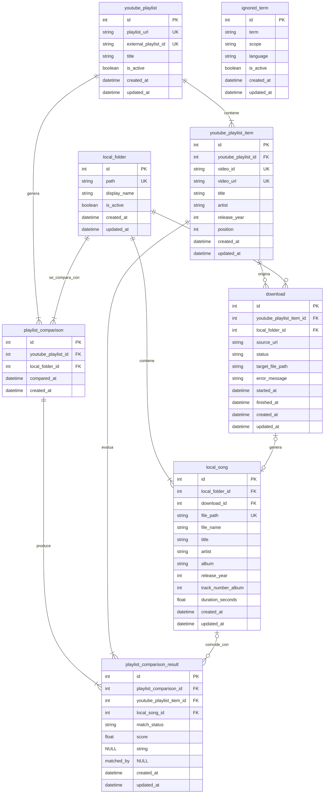

# Modelo Relacional

## Objetivo

Este documento traduce el modelo entidad-relacion a tablas relacionales concretas.

Se prioriza:

* comparacion entre `youtube_playlist` y `local_folder`
* persistencia de ejecuciones de comparacion
* deteccion de canciones faltantes
* soporte CRUD para terminos ignorados

## Diagrama Mermaid

## Tablas

### `local_folder`

Representa una carpeta local guardada por la app.

Columnas clave:

* `path`: ruta completa de la carpeta
* `display_name`: nombre visible para UI
* `is_active`: indica si es la carpeta operativa actual

Restricciones:

* `path` debe ser unico
* solo una carpeta debe estar activa al mismo tiempo a nivel de aplicacion

### `local_song`

Representa una cancion existente en disco dentro de una carpeta local.

Columnas clave:

* `local_folder_id`
* `download_id` nullable
* `file_path`
* `title`
* `artist`
* `album`
* `release_year`
* `track_number_album`
* `duration_seconds`

Restricciones:

* `file_path` debe ser unico
* cada cancion pertenece a una sola `local_folder`
* `download_id` es nullable porque una cancion puede no venir de descarga
* `track_number_album` debe cumplir `>= 0` cuando tenga valor

Notas de carga actual:

* el escaneo local registra la cancion a partir del archivo `.mp3`
* `file_path` y `file_name` salen del filesystem
* `title`, `artist`, `album`, `release_year`, `track_number_album` y `duration_seconds` se rellenan desde metadata leida con `Mutagen`
* si un archivo no contiene tags legibles, la aplicacion usa valores de fallback seguros

### `youtube_playlist`

Representa una playlist de YouTube guardada en la app.

Columnas clave:

* `playlist_url`
* `external_playlist_id`
* `title`
* `is_active`

Restricciones:

* `playlist_url` debe ser unica
* `external_playlist_id` debe ser unico
* solo una playlist debe estar activa al mismo tiempo a nivel de aplicacion

Notas:

* `title` guarda el nombre visible definido por el usuario dentro de la app
* `external_playlist_id` guarda el id externo real de YouTube
* `id` es la clave primaria interna de la tabla

### `youtube_playlist_item`

Representa una cancion o video individual dentro de una playlist de YouTube.

Columnas clave:

* `youtube_playlist_id`
* `video_id`
* `video_url`
* `title`
* `artist`
* `release_year`
* `position`

Restricciones:

* `video_url` debe ser unica
* `video_id` debe ser unico
* `position` deberia ser unica dentro de cada playlist

### `playlist_comparison`

Representa una ejecucion de comparacion entre una playlist y una carpeta local.

Columnas clave:

* `youtube_playlist_id`
* `local_folder_id`
* `compared_at`

Notas:

* normalmente se genera una nueva comparacion al abrir la app y ejecutar la revision

### `playlist_comparison_result`

Representa el resultado por cada `youtube_playlist_item` dentro de una comparacion.

Columnas clave:

* `playlist_comparison_id`
* `youtube_playlist_item_id`
* `local_song_id` nullable
* `match_status`
* `score`
* `matched_by`

Estados de `match_status`:

* `matched`
* `missing`
* `possible_match`

Restricciones:

* `local_song_id` sera `NULL` cuando la cancion falte
* `score` puede ser `NULL`
* `matched_by` puede ser `NULL`
* deberia existir una sola fila por pareja `playlist_comparison_id + youtube_playlist_item_id`

### `download`

Representa un intento de descarga iniciado desde un item de playlist de YouTube.

Columnas clave:

* `youtube_playlist_item_id`
* `local_folder_id`
* `source_url`
* `status`
* `target_file_path`
* `error_message`
* `started_at`
* `finished_at`

Notas:

* la descarga nace desde `youtube_playlist_item`
* el destino final es una `local_folder`
* puede acabar generando una `local_song`
* `status` debe usar este catalogo inicial:
  * `pending`
  * `in_progress`
  * `completed`
  * `failed`
* la lista de errores posibles debe vivir en codigo, no en la base de datos
* `error_message` guarda el detalle concreto del fallo ocurrido

### `ignored_term`

Representa un termino ignorado configurable para la normalizacion y el matching.

Columnas clave:

* `term`
* `scope`
* `language`
* `is_active`

Restricciones:

* conviene evitar duplicados por combinacion `term + scope + language`

## Relaciones y reglas

### Carpeta operativa

Se pueden guardar varias carpetas, pero solo una debe ser la activa.

Esto se puede resolver:

* con validacion de aplicacion
* o con una restriccion parcial si el motor lo permite

Dado que el proyecto usa SQLite en local y MySQL en CI, es mas portable resolverlo desde la aplicacion.

### Playlist operativa

Se pueden guardar varias playlists, pero solo una debe ser la activa.

Igual que en `local_folder`, es mas portable resolverlo desde la aplicacion.

### Resultado de comparacion

La cancion esperada de la playlist siempre vive en `youtube_playlist_item`.

Si falta en local:

* existe `youtube_playlist_item`
* existe `playlist_comparison_result`
* `local_song_id = NULL`
* `match_status = missing`

### Descarga

La descarga se inicia desde `youtube_playlist_item` porque ahi vive la URL de origen.

Si termina correctamente, puede quedar enlazada con `local_song`.

## Integridad en BBDD vs integridad en aplicacion

## Reglas que deben vivir en BBDD

Estas reglas son estructurales y deben reforzarse con el esquema relacional:

* claves primarias de todas las tablas
* claves foraneas entre tablas relacionadas
* unicidad de:
  * `local_folder.path`
  * `local_song.file_path`
  * `youtube_playlist.playlist_url`
  * `youtube_playlist.external_playlist_id`
  * `youtube_playlist_item.video_id`
  * `youtube_playlist_item.video_url`
  * `playlist_comparison_result (playlist_comparison_id, youtube_playlist_item_id)`
  * `ignored_term (term, scope, language)`
* nulabilidad segun el modelo definido
* checks simples cuando se implementen:
  * `track_number_album >= 0`
  * `position > 0`
  * `duration_seconds >= 0` si tiene valor
* indices de soporte para claves foraneas y consultas frecuentes

## Reglas que deben vivir en aplicacion

Estas reglas dependen del flujo del sistema o son mas portables si se resuelven fuera de la BBDD:

* solo una `local_folder` puede estar activa al mismo tiempo
* solo una `youtube_playlist` puede estar activa al mismo tiempo
* validacion de que la ruta de `local_folder.path` exista realmente
* validacion de que `playlist_url` sea una URL de YouTube valida
* normalizacion de titulos y artistas
* matching entre `youtube_playlist_item` y `local_song`
* calculo de `score`
* calculo de `matched_by`
* asignacion de `match_status`
* catalogo de errores posibles de `download`
* control de transiciones de `download.status`
* control del flujo completo de descarga y posterior insercion en `local_song`

## Criterio general

* la BBDD protege estructura, referencias y unicidad objetiva
* la aplicacion protege reglas operativas, validaciones de entorno y decisiones de negocio dinamicas
