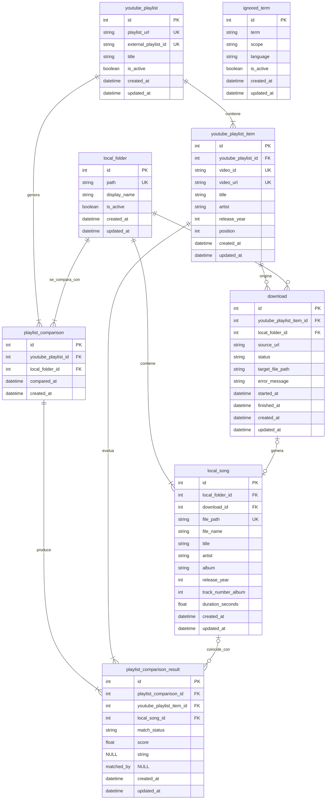

# Modelo Relacional

## Objetivo

Este documento traduce el modelo entidad-relacion a tablas relacionales concretas.

Se prioriza:

* comparacion entre `youtube_playlist` y `local_folder`
* persistencia de ejecuciones de comparacion
* deteccion de canciones faltantes
* soporte CRUD para terminos ignorados

## Diagrama Mermaid

## Tablas

### `local_folder`

Representa una carpeta local guardada por la app.

Columnas clave:

* `path`: ruta completa de la carpeta
* `display_name`: nombre visible para UI
* `is_active`: indica si es la carpeta operativa actual

Restricciones:

* `path` debe ser unico
* solo una carpeta debe estar activa al mismo tiempo a nivel de aplicacion

### `local_song`

Representa una cancion existente en disco dentro de una carpeta local.

Columnas clave:

* `local_folder_id`
* `download_id` nullable
* `file_path`
* `title`
* `artist`
* `album`
* `release_year`
* `track_number_album`
* `duration_seconds`

Restricciones:

* `file_path` debe ser unico
* cada cancion pertenece a una sola `local_folder`
* `download_id` es nullable porque una cancion puede no venir de descarga

### `youtube_playlist`

Representa una playlist de YouTube guardada en la app.

Columnas clave:

* `playlist_url`
* `external_playlist_id`
* `title`
* `is_active`

Restricciones:

* `playlist_url` debe ser unica
* `external_playlist_id` debe ser unico
* solo una playlist debe estar activa al mismo tiempo a nivel de aplicacion

### `youtube_playlist_item`

Representa una cancion o video individual dentro de una playlist de YouTube.

Columnas clave:

* `youtube_playlist_id`
* `video_id`
* `video_url`
* `title`
* `artist`
* `release_year`
* `position`

Restricciones:

* `video_url` debe ser unica
* `video_id` debe ser unico
* `position` deberia ser unica dentro de cada playlist

### `playlist_comparison`

Representa una ejecucion de comparacion entre una playlist y una carpeta local.

Columnas clave:

* `youtube_playlist_id`
* `local_folder_id`
* `compared_at`

Notas:

* normalmente se genera una nueva comparacion al abrir la app y ejecutar la revision

### `playlist_comparison_result`

Representa el resultado por cada `youtube_playlist_item` dentro de una comparacion.

Columnas clave:

* `playlist_comparison_id`
* `youtube_playlist_item_id`
* `local_song_id` nullable
* `match_status`
* `score`
* `matched_by`

Estados de `match_status`:

* `matched`
* `missing`
* `possible_match`

Restricciones:

* `local_song_id` sera `NULL` cuando la cancion falte
* `score` puede ser `NULL`
* `matched_by` puede ser `NULL`
* deberia existir una sola fila por pareja `playlist_comparison_id + youtube_playlist_item_id`

### `download`

Representa un intento de descarga iniciado desde un item de playlist de YouTube.

Columnas clave:

* `youtube_playlist_item_id`
* `local_folder_id`
* `source_url`
* `status`
* `target_file_path`
* `error_message`
* `started_at`
* `finished_at`

Notas:

* la descarga nace desde `youtube_playlist_item`
* el destino final es una `local_folder`
* puede acabar generando una `local_song`
* `status` debe usar este catalogo inicial:
  * `pending`
  * `in_progress`
  * `completed`
  * `failed`
* la lista de errores posibles debe vivir en codigo, no en la base de datos
* `error_message` guarda el detalle concreto del fallo ocurrido

### `ignored_term`

Representa un termino ignorado configurable para la normalizacion y el matching.

Columnas clave:

* `term`
* `scope`
* `language`
* `is_active`

Restricciones:

* conviene evitar duplicados por combinacion `term + scope + language`

## Relaciones y reglas

### Carpeta operativa

Se pueden guardar varias carpetas, pero solo una debe ser la activa.

Esto se puede resolver:

* con validacion de aplicacion
* o con una restriccion parcial si el motor lo permite

Dado que el proyecto usa SQLite en local y MySQL en CI, es mas portable resolverlo desde la aplicacion.

### Playlist operativa

Se pueden guardar varias playlists, pero solo una debe ser la activa.

Igual que en `local_folder`, es mas portable resolverlo desde la aplicacion.

### Resultado de comparacion

La cancion esperada de la playlist siempre vive en `youtube_playlist_item`.

Si falta en local:

* existe `youtube_playlist_item`
* existe `playlist_comparison_result`
* `local_song_id = NULL`
* `match_status = missing`

### Descarga

La descarga se inicia desde `youtube_playlist_item` porque ahi vive la URL de origen.

Si termina correctamente, puede quedar enlazada con `local_song`.
