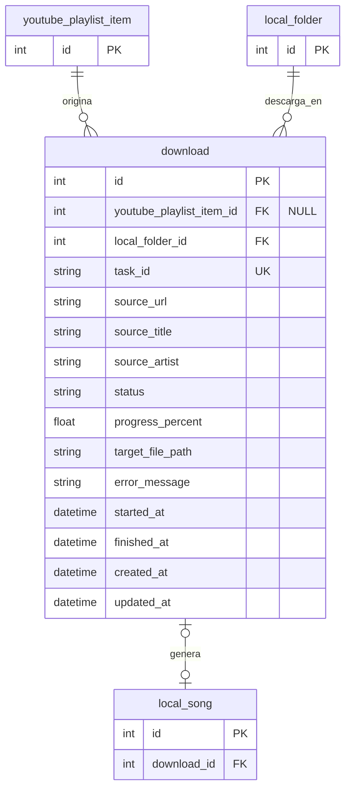

# Tabla `download`

## Nombre

`download`

## Objetivo

Representa un intento de descarga de audio desde YouTube hacia una carpeta local
registrada. Puede originarse en un item importado o en una URL introducida
manualmente.

## Columnas

| Columna | Tipo conceptual | Requerido | Restricciones | Descripcion |
| --- | --- | --- | --- | --- |
| `id` | entero | si | PK | Identificador unico |
| `youtube_playlist_item_id` | entero | no | FK | Item de YouTube origen cuando existe |
| `local_folder_id` | entero | si | FK | Carpeta destino |
| `task_id` | texto | si | UK | Identificador de la tarea local |
| `source_url` | texto | si | - | URL origen de la descarga |
| `source_title` | texto | no | - | Titulo detectado o conocido del origen |
| `source_artist` | texto | no | - | Artista detectado o conocido del origen |
| `status` | texto | si | - | Estado de la descarga |
| `progress_percent` | real | si | `0..100` | Progreso confirmado por `yt-dlp` |
| `target_file_path` | texto | no | - | Ruta final esperada o generada |
| `error_message` | texto | no | - | Detalle del error si falla |
| `started_at` | fecha-hora | no | - | Momento de inicio |
| `finished_at` | fecha-hora | no | - | Momento de fin |
| `created_at` | fecha-hora | si | - | Fecha de creacion |
| `updated_at` | fecha-hora | si | - | Fecha de ultima actualizacion |

## Relaciones

* un `download` puede nacer de un `youtube_playlist_item`
* cada `download` apunta a una `local_folder`
* un `download` puede generar una `local_song`

## Diagrama Mermaid

## Notas

* `status` debe usar este catalogo inicial:
  * `pending`
  * `in_progress`
  * `completed`
  * `failed`
  * `cancelled`
* `youtube_playlist_item` no guarda ya una URL de video canonica; `source_url` se resuelve en el flujo de descarga a partir del item importado y su identificador externo.
* `youtube_playlist_item_id` es nulo cuando el usuario pega directamente una URL.
* `task_id` permite correlacionar la fila con la tarea local consultada mediante polling.
* la ruta final se construye exclusivamente dentro de la `local_folder` elegida.
* La lista de errores posibles debe vivir en codigo.
* `error_message` solo guarda el detalle concreto del fallo ocurrido.
