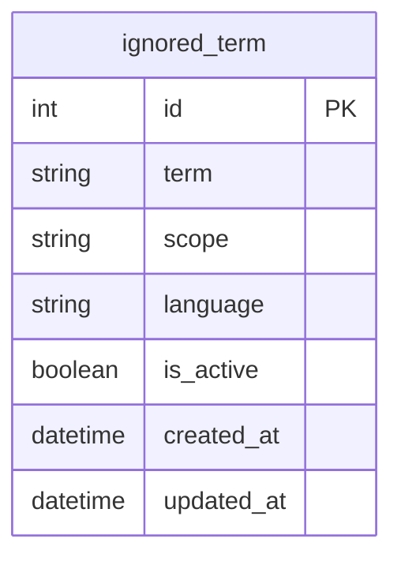

# Tabla `ignored_term`

## Nombre

`ignored_term`

## Objetivo

Representa un termino ignorado configurable para la normalizacion y el matching.

Permite CRUD desde la app sin tocar codigo.

## Columnas

| Columna | Tipo conceptual | Requerido | Restricciones | Descripcion |
| --- | --- | --- | --- | --- |
| `id` | entero | si | PK | Identificador unico |
| `term` | texto | si | - | Termino a ignorar |
| `scope` | texto | si | - | Ambito donde aplica |
| `language` | texto | no | - | Idioma asociado |
| `is_active` | booleano | si | - | Indica si el termino esta activo |
| `created_at` | fecha-hora | si | - | Fecha de creacion |
| `updated_at` | fecha-hora | si | - | Fecha de ultima actualizacion |

## Relaciones

* `ignored_term` no tiene relaciones fuertes con otras tablas
* se usa como soporte de configuracion para el proceso de matching

## Diagrama Mermaid

## Notas

* Conviene evitar duplicados por combinacion `term + scope + language`.
