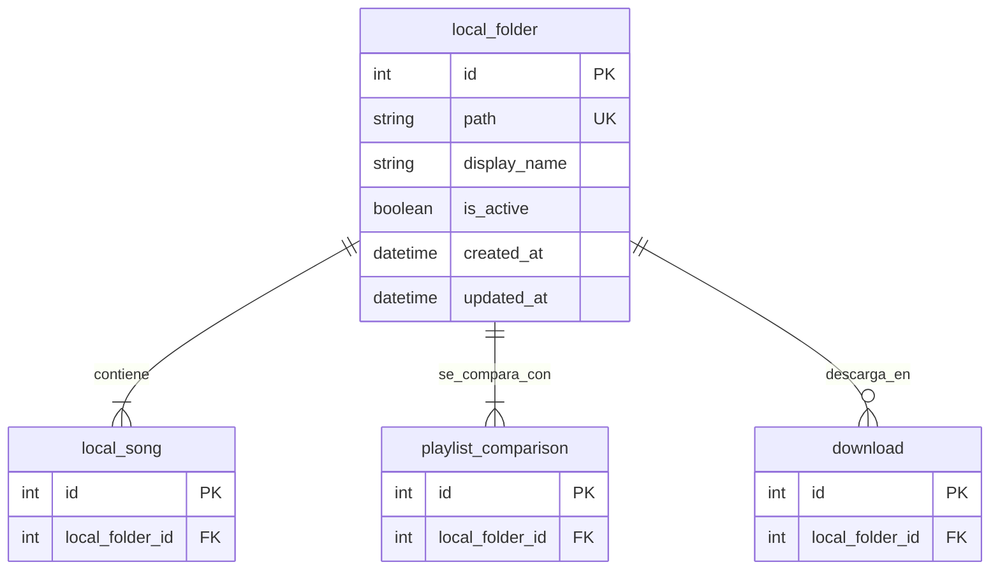

# Tabla `local_folder`

## Nombre

`local_folder`

## Objetivo

Representa una carpeta local guardada por la aplicacion.

La app puede recordar varias carpetas, pero solo una debe estar activa como carpeta operativa.

## Columnas

| Columna | Tipo conceptual | Requerido | Restricciones | Descripcion |
| --- | --- | --- | --- | --- |
| `id` | entero | si | PK | Identificador unico |
| `path` | texto | si | UNIQUE | Ruta completa de la carpeta |
| `display_name` | texto | si | - | Nombre visible para UI |
| `is_active` | booleano | si | - | Indica si es la carpeta operativa |
| `created_at` | fecha-hora | si | - | Fecha de creacion |
| `updated_at` | fecha-hora | si | - | Fecha de ultima actualizacion |

## Relaciones

* `local_folder` contiene muchas `local_song`
* `local_folder` participa en muchas `playlist_comparison`
* `local_folder` recibe muchas `download`

## Diagrama Mermaid

## Notas

* La restriccion de una sola carpeta activa debe resolverse desde la aplicacion para mantener compatibilidad entre SQLite y MySQL.
