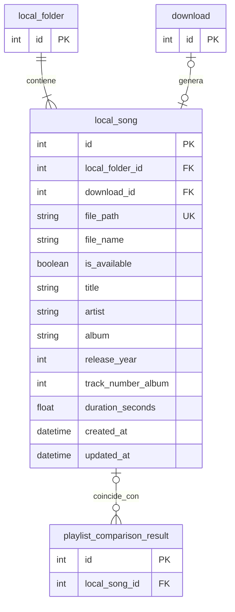

# Tabla `local_song`

## Nombre

`local_song`

## Objetivo

Representa una cancion existente en disco dentro de una carpeta local.

Es la fuente local que se compara contra los items de YouTube.

## Columnas

| Columna | Tipo conceptual | Requerido | Restricciones | Descripcion |
| --- | --- | --- | --- | --- |
| `id` | entero | si | PK | Identificador unico |
| `local_folder_id` | entero | si | FK | Carpeta local a la que pertenece |
| `download_id` | entero | no | FK | Descarga que origino la cancion |
| `file_path` | texto | si | UNIQUE | Ruta completa del archivo |
| `file_name` | texto | si | - | Nombre del archivo |
| `is_available` | booleano | si | - | Indica si el archivo sigue presente en el ultimo escaneo de la carpeta |
| `title` | texto | si | - | Titulo de la cancion |
| `artist` | texto | si | - | Artista principal |
| `album` | texto | si | - | Album; si no hay tag se guarda vacio |
| `release_year` | entero | si | - | Año de lanzamiento; si no hay tag se guarda `0` |
| `track_number_album` | entero | si | - | Numero de pista dentro del album; si no hay tag se guarda `0` |
| `duration_seconds` | decimal | si | - | Duracion en segundos; si no puede calcularse se guarda `0.0` |
| `created_at` | fecha-hora | si | - | Fecha de creacion |
| `updated_at` | fecha-hora | si | - | Fecha de ultima actualizacion |

## Relaciones

* cada `local_song` pertenece a una sola `local_folder`
* una `local_song` puede provenir de una `download`
* una `local_song` puede aparecer en muchos `playlist_comparison_result`

## Diagrama Mermaid

## Notas

* `file_path` debe ser unico para impedir duplicados fisicos.
* En la carpeta local no deben existir canciones repetidas como regla de negocio.
* Durante el escaneo local, `file_path` y `file_name` se obtienen del filesystem.
* `is_available` queda en `true` cuando el archivo aparece en el ultimo escaneo y en `false` cuando desaparece sin poder reconciliarse como movido.
* `title`, `artist`, `album`, `release_year`, `track_number_album` y `duration_seconds` se intentan extraer con `Mutagen`.
* Si el MP3 no tiene tags o falla la lectura de metadata, la app usa fallback seguro:
  * `title`: nombre del archivo sin extension
  * `artist`: cadena vacia
  * `album`: cadena vacia
  * `release_year`: `0`
  * `track_number_album`: `0`
  * `duration_seconds`: `0.0`
* La deteccion de movidas se hace de forma conservadora:
  * la ruta nueva debe mantener el mismo `file_name`
  * la metadata basica debe coincidir exactamente con la ultima persistida
