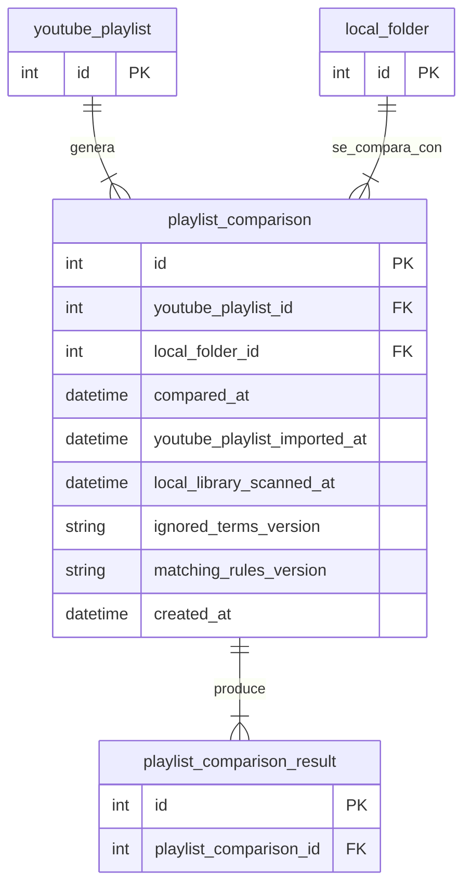

# Tabla `playlist_comparison`

## Nombre

`playlist_comparison`

## Objetivo

Representa una ejecucion de comparacion entre una playlist de YouTube y una carpeta local.

Actua como cabecera del proceso de comparacion.

## Columnas

| Columna | Tipo conceptual | Requerido | Restricciones | Descripcion |
| --- | --- | --- | --- | --- |
| `id` | entero | si | PK | Identificador unico |
| `youtube_playlist_id` | entero | si | FK | Playlist comparada |
| `local_folder_id` | entero | si | FK | Carpeta local comparada |
| `compared_at` | fecha-hora | si | - | Momento real de la comparacion |
| `youtube_playlist_imported_at` | fecha-hora | no | - | Marca de tiempo del snapshot YouTube usado por la comparacion |
| `local_library_scanned_at` | fecha-hora | no | - | Marca de tiempo del snapshot local usado por la comparacion |
| `ignored_terms_version` | texto | no | - | Fingerprint de los ignored terms aplicados |
| `matching_rules_version` | texto | no | - | Version logica de reglas de matching usadas |
| `created_at` | fecha-hora | si | - | Fecha de creacion del registro |

## Relaciones

* cada `playlist_comparison` pertenece a una `youtube_playlist`
* cada `playlist_comparison` pertenece a una `local_folder`
* una `playlist_comparison` produce muchos `playlist_comparison_result`

## Diagrama Mermaid

## Notas

* Se genera una nueva comparacion cuando el usuario ejecuta manualmente la accion de comparar.
* Cada fila actua como cabecera de un snapshot persistido de resultados.
* La cabecera tambien guarda las dependencias del matching para invalidar de forma incremental los `FOUND` previos.
* Las filas se conservan para permitir un historico de comparaciones por combinacion de `youtube_playlist` y `local_folder`.
* La retencion del historico se calcula por scope exacto:
  * `youtube_playlist_id`
  * `local_folder_id`
* Solo se conservan las `3` comparaciones mas recientes por scope.
* La ordenacion de retencion usa `compared_at desc, id desc`.
* Cuando un scope supera el limite, la aplicacion elimina primero las filas hijas en `playlist_comparison_result` y despues la cabecera de `playlist_comparison`.
* El objetivo de esta politica es controlar el crecimiento del snapshot historico en base de datos sin perder el ultimo estado util ni el historico corto reciente.
