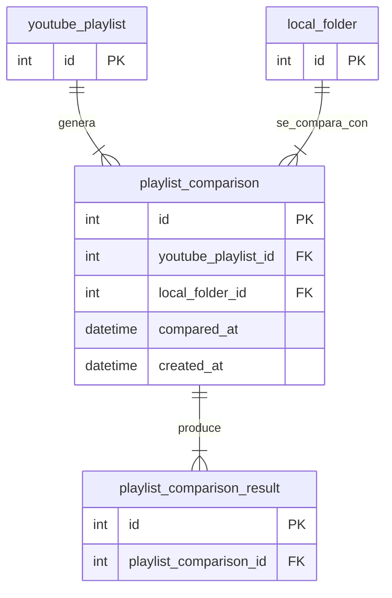

# Tabla `playlist_comparison`

## Nombre

`playlist_comparison`

## Objetivo

Representa una ejecucion de comparacion entre una playlist de YouTube y una carpeta local.

Actua como cabecera del proceso de comparacion.

## Columnas

| Columna | Tipo conceptual | Requerido | Restricciones | Descripcion |
| --- | --- | --- | --- | --- |
| `id` | entero | si | PK | Identificador unico |
| `youtube_playlist_id` | entero | si | FK | Playlist comparada |
| `local_folder_id` | entero | si | FK | Carpeta local comparada |
| `compared_at` | fecha-hora | si | - | Momento real de la comparacion |
| `created_at` | fecha-hora | si | - | Fecha de creacion del registro |

## Relaciones

* cada `playlist_comparison` pertenece a una `youtube_playlist`
* cada `playlist_comparison` pertenece a una `local_folder`
* una `playlist_comparison` produce muchos `playlist_comparison_result`

## Diagrama Mermaid

## Notas

* Normalmente se genera una nueva comparacion al abrir la app y ejecutar la revision.
