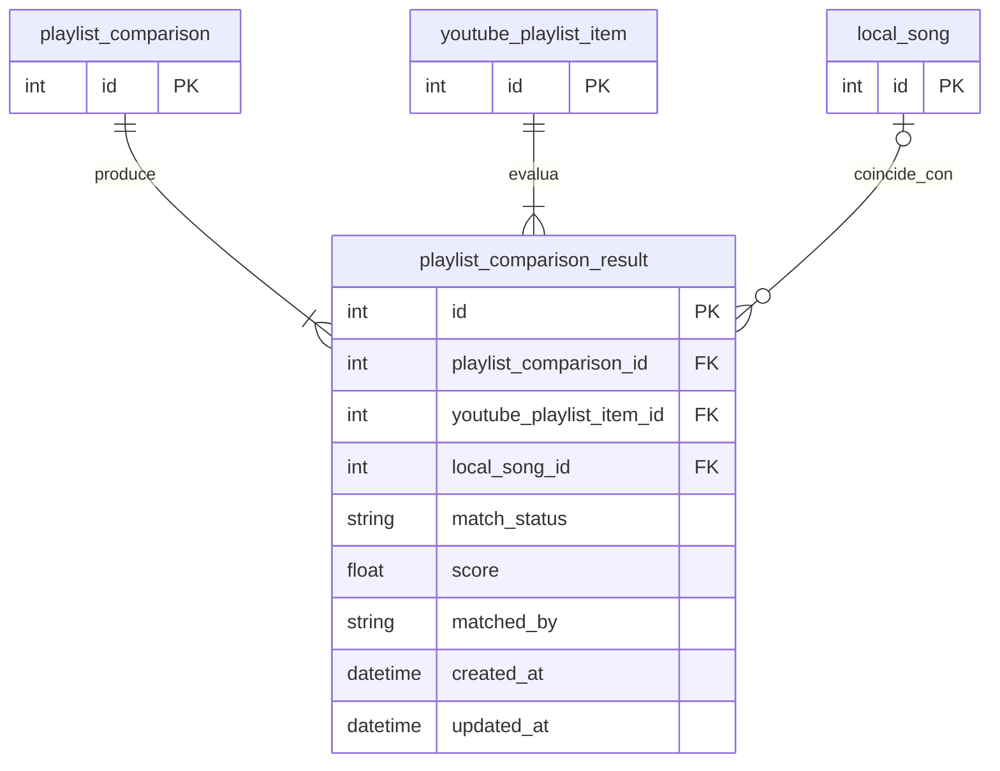

# Tabla `playlist_comparison_result`

## Nombre

`playlist_comparison_result`

## Objetivo

Representa el resultado de comparar un `youtube_playlist_item` concreto dentro de una ejecucion de comparacion.

Es la tabla clave para detectar canciones encontradas o faltantes.

## Columnas

| Columna | Tipo conceptual | Requerido | Restricciones | Descripcion |
| --- | --- | --- | --- | --- |
| `id` | entero | si | PK | Identificador unico |
| `playlist_comparison_id` | entero | si | FK | Comparacion a la que pertenece |
| `youtube_playlist_item_id` | entero | si | FK | Item de YouTube evaluado |
| `local_song_id` | entero | no | FK | Cancion local asociada si existe |
| `match_status` | texto | si | - | Estado final del matching |
| `score` | decimal | no | - | Puntuacion calculada por el algoritmo |
| `matched_by` | texto | no | - | Metodo o criterio usado para resolver el matching |
| `created_at` | fecha-hora | si | - | Fecha de creacion |
| `updated_at` | fecha-hora | si | - | Fecha de ultima actualizacion |

## Relaciones

* cada `playlist_comparison_result` pertenece a una `playlist_comparison`
* cada `playlist_comparison_result` evalua un `youtube_playlist_item`
* `playlist_comparison_result` puede apuntar a una `local_song` o a ninguna

## Diagrama Mermaid

## Notas

* `match_status` debe usar este catalogo:
  * `matched`
  * `missing`
  * `possible_match`
* Si una cancion falta en local:
  * existe `youtube_playlist_item`
  * existe `playlist_comparison_result`
  * `local_song_id` queda en `NULL`
  * `match_status` vale `missing`
* Debe existir una sola fila por pareja `playlist_comparison_id + youtube_playlist_item_id`.
