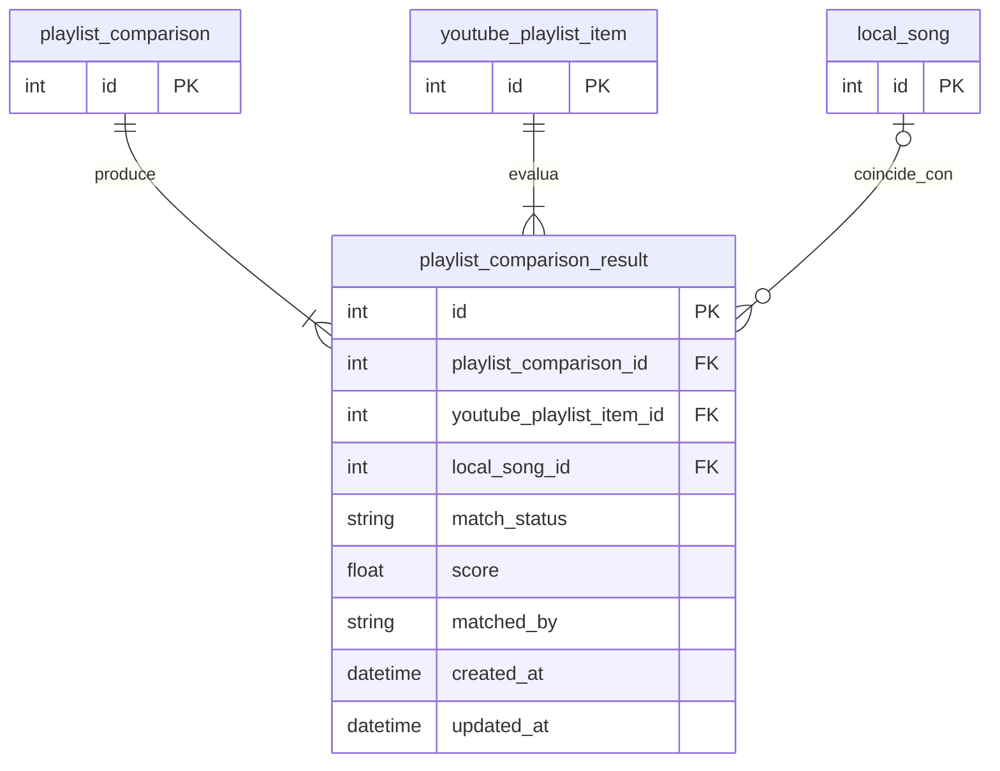

# Tabla `playlist_comparison_result`

## Nombre

`playlist_comparison_result`

## Objetivo

Representa el resultado de comparar un `youtube_playlist_item` concreto dentro de una ejecucion de comparacion.

Es la tabla clave para detectar canciones encontradas o faltantes.

Tambien actua como fuente final del ajuste manual hecho por el usuario sobre un snapshot ya persistido.

La semantica funcional vigente de sus estados y razones se documenta en:

* [comparisonContext.md](../../architecture/comparisonContext.md)

## Columnas

| Columna | Tipo conceptual | Requerido | Restricciones | Descripcion |
| --- | --- | --- | --- | --- |
| `id` | entero | si | PK | Identificador unico |
| `playlist_comparison_id` | entero | si | FK | Comparacion a la que pertenece |
| `youtube_playlist_item_id` | entero | si | FK | Item de YouTube evaluado |
| `local_song_id` | entero | no | FK | Cancion local asociada si existe |
| `match_status` | texto | si | - | Estado final del matching |
| `score` | decimal | no | - | Puntuacion calculada por el algoritmo |
| `matched_by` | texto | no | - | Origen controlado de la decision final, automatico o manual |
| `created_at` | fecha-hora | si | - | Fecha de creacion |
| `updated_at` | fecha-hora | si | - | Fecha de ultima actualizacion |

## Relaciones

* cada `playlist_comparison_result` pertenece a una `playlist_comparison`
* cada `playlist_comparison_result` evalua un `youtube_playlist_item`
* `playlist_comparison_result` puede apuntar a una `local_song` o a ninguna

## Diagrama Mermaid

## Notas

* `match_status` debe usar este catalogo:
  * `found`
  * `missing`
  * `possible_match`
* Esta tabla admite ajuste manual directo sobre una fila ya persistida.
* El flujo manual siempre nace desde `youtube_playlist_item`:
  * el usuario abre un resultado de comparacion
  * decide el `match_status`
  * y opcionalmente enlaza una `local_song`
* La aplicacion puede editar manualmente:
  * `match_status`
  * `local_song_id`
  * `matched_by`
* Si una cancion falta en local:
  * existe `youtube_playlist_item`
  * existe `playlist_comparison_result`
  * `local_song_id` queda en `NULL`
  * `match_status` vale `missing`
* Debe existir una sola fila por pareja `playlist_comparison_id + youtube_playlist_item_id`.
* `matched_by` no debe usarse como texto libre arbitrario.
* No se persisten columnas redundantes como `is_locked_found` o `invalidated_reason`.
* Validaciones operativas en aplicacion:
  * `match_status = missing` obliga `local_song_id = NULL`
  * `match_status = found` obliga `local_song_id` informado
  * `match_status = possible_match` permite `local_song_id = NULL`, aunque puede conservar una candidata elegida manualmente
* Convencion actual:
  * automatico:
    * `auto:title_artist_duration`
    * `auto:ambiguous`
    * `auto:no_title_match`
    * `auto:title_without_artist_match`
    * `auto:reserved_local_song_excluded`
  * manual:
    * `manual:user_linked_local_song`
    * `manual:user_marked_found`
    * `manual:user_marked_missing`
    * `manual:user_marked_possible`
* Significado funcional vigente:
  * `found` exige titulo y artista validados antes del score final
  * `possible_match` queda reservado a ambigüedad real entre candidatas ya validadas
  * `missing` cubre ausencia de titulo, ausencia de artista valido o ausencia de candidata util tras exclusiones
* El `score` se conserva aunque el usuario corrija manualmente la fila.
* Cuando `matched_by` empiece por `manual:`, el `score` deja de actuar como verdad del estado final y queda solo como referencia del matching automatico previo.
* `matched_by` distingue explicitamente el origen de la fila:
  * `auto:*` para decisiones del matcher
  * `manual:*` para correcciones del usuario
* El estado de una fila `FOUND` congelada se deriva de:
  * la propia fila
  * la cabecera `playlist_comparison`
  * el estado actual de `local_song`
  * el estado actual de `youtube_playlist_item`
* El motivo de invalidacion no se persiste porque depende de comparar ese snapshot con estado vivo posterior.
* Esta tabla forma parte del snapshot historico de comparacion y hereda la politica de retencion por scope desde `playlist_comparison`.
* La edicion manual vive solo en el snapshot actual que el usuario esta editando.
* Si se ejecuta una comparacion nueva:
  * se crea un snapshot nuevo
  * el nuevo calculo no reaplica automaticamente overrides manuales del snapshot anterior
* No se conservan filas huérfanas:
  * al purgar comparaciones antiguas, la aplicacion borra primero los resultados hijos
  * despues elimina la cabecera asociada en `playlist_comparison`
* El maximo retenido es indirectamente `3` snapshots por scope, no `3` filas de resultado.
* El motivo de esta limpieza coordinada es limitar el crecimiento rapido de `playlist_comparison_result`, que escala con el numero de items comparados por cada ejecucion.
