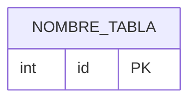

# Plantilla de Tabla

## Nombre

`nombre_tabla`

## Objetivo

Describe la responsabilidad funcional de la tabla dentro del dominio.

## Columnas

| Columna | Tipo conceptual | Requerido | Restricciones | Descripcion |
| --- | --- | --- | --- | --- |
| `id` | entero | si | PK | Identificador unico |

## Relaciones

* Indicar relaciones con otras tablas
* Indicar cardinalidades relevantes
* Indicar si la relacion nace de una FK directa o de una tabla intermedia

## Diagrama Mermaid

## Notas

* Anotar decisiones importantes de modelado
* Indicar dudas abiertas si las hay
