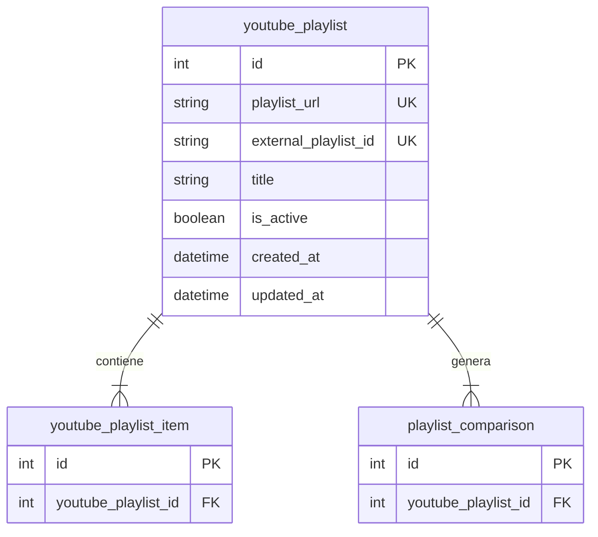

# Tabla `youtube_playlist`

## Nombre

`youtube_playlist`

## Objetivo

Representa una playlist de YouTube guardada por la aplicacion.

La app puede recordar varias playlists, pero solo una debe estar activa como playlist operativa.

## Columnas

| Columna | Tipo conceptual | Requerido | Restricciones | Descripcion |
| --- | --- | --- | --- | --- |
| `id` | entero | si | PK | Identificador unico |
| `playlist_url` | texto | si | UNIQUE | URL completa de la playlist |
| `external_playlist_id` | texto | si | UNIQUE | Identificador externo de YouTube |
| `title` | texto | si | - | Nombre visible definido por el usuario para identificar la playlist dentro de la app |
| `is_active` | booleano | si | - | Indica si es la playlist operativa |
| `created_at` | fecha-hora | si | - | Fecha de creacion |
| `updated_at` | fecha-hora | si | - | Fecha de ultima actualizacion |

## Relaciones

* `youtube_playlist` contiene muchos `youtube_playlist_item`
* `youtube_playlist` genera muchas `playlist_comparison`

## Diagrama Mermaid

## Notas

* La restriccion de una sola playlist activa debe resolverse desde la aplicacion.
* `external_playlist_id` guarda exclusivamente el id externo que viene de YouTube.
* `id` sigue siendo el identificador interno de la tabla.
* `title` no es el id ni un alias tecnico: es el nombre visible que el usuario decide usar.
