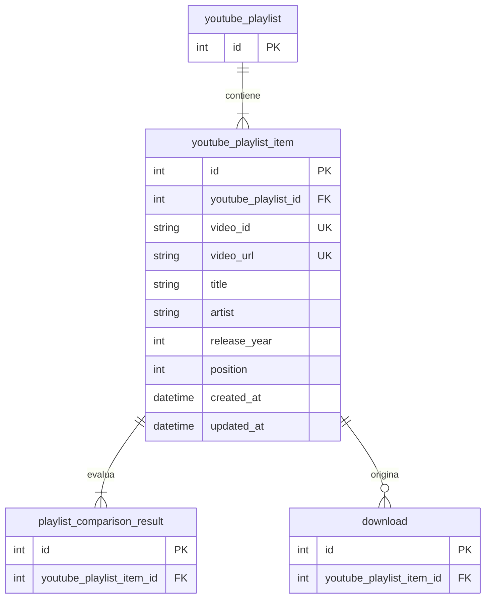

# Tabla `youtube_playlist_item`

## Nombre

`youtube_playlist_item`

## Objetivo

Representa una cancion o video individual dentro de una playlist de YouTube.

Es la cancion esperada que luego se compara contra la biblioteca local.

## Columnas

| Columna | Tipo conceptual | Requerido | Restricciones | Descripcion |
| --- | --- | --- | --- | --- |
| `id` | entero | si | PK | Identificador unico |
| `youtube_playlist_id` | entero | si | FK | Playlist a la que pertenece |
| `video_id` | texto | si | UNIQUE | Identificador unico del video en YouTube |
| `video_url` | texto | si | UNIQUE | URL completa del video |
| `title` | texto | si | - | Titulo del item |
| `artist` | texto | no | - | Artista o autor detectado |
| `release_year` | entero | no | - | Año de lanzamiento |
| `position` | entero | si | UNIQUE por playlist | Posicion dentro de la playlist |
| `created_at` | fecha-hora | si | - | Fecha de creacion |
| `updated_at` | fecha-hora | si | - | Fecha de ultima actualizacion |

## Relaciones

* cada `youtube_playlist_item` pertenece a una sola `youtube_playlist`
* un `youtube_playlist_item` puede aparecer en muchos `playlist_comparison_result`
* un `youtube_playlist_item` puede originar muchas `download`

## Diagrama Mermaid

## Notas

* `position` debe ser unica dentro de cada playlist, no necesariamente global.
* Si una cancion falta en local, sigue existiendo en esta tabla y se marca en `playlist_comparison_result`.
