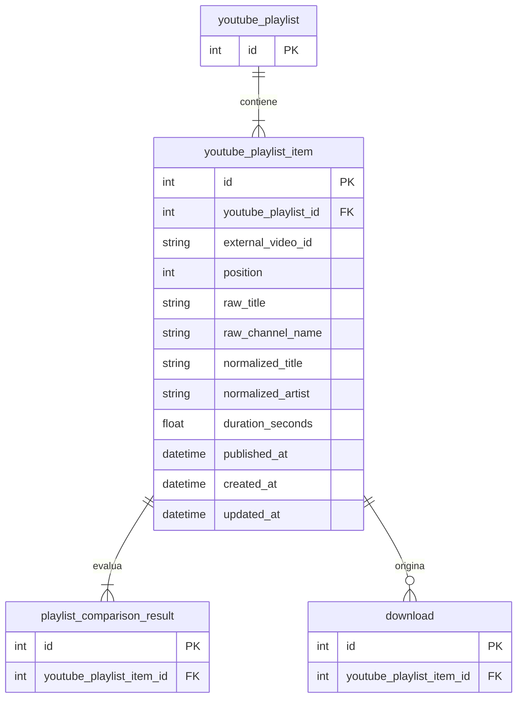

# Tabla `youtube_playlist_item`

## Nombre

`youtube_playlist_item`

## Objetivo

Representa el snapshot persistido de los items importados de una playlist de YouTube.

Cada fila conserva tanto el dato bruto extraido de YouTube como los campos normalizados que luego serviran para comparar contra `local_song`.

## Columnas

| Columna | Tipo conceptual | Requerido | Restricciones | Descripcion |
| --- | --- | --- | --- | --- |
| `id` | entero | si | PK | Identificador interno |
| `youtube_playlist_id` | entero | si | FK | Playlist a la que pertenece el item |
| `external_video_id` | texto | si | UNIQUE por playlist | Identificador externo del video en YouTube |
| `position` | entero | si | indice por playlist, `> 0` | Posicion del item dentro de la playlist |
| `raw_title` | texto | si | - | Titulo original extraido de YouTube |
| `raw_channel_name` | texto | si | - | Nombre original del canal asociado al item |
| `normalized_title` | texto | si | - | Titulo preparado para futura comparacion |
| `normalized_artist` | texto | si | - | Artista inferido o normalizado para futura comparacion |
| `duration_seconds` | decimal | no | `>= 0` si existe | Duracion del item en segundos |
| `published_at` | fecha-hora | no | - | Fecha de publicacion si la fuente la devuelve |
| `created_at` | fecha-hora | si | - | Fecha de creacion del registro |
| `updated_at` | fecha-hora | si | - | Fecha de ultima actualizacion |

## Relaciones

* cada `youtube_playlist_item` pertenece a una sola `youtube_playlist`
* un `youtube_playlist_item` puede aparecer en muchos `playlist_comparison_result`
* un `youtube_playlist_item` puede originar muchas `download`

## Restricciones relevantes

* la pareja `youtube_playlist_id + external_video_id` debe ser unica
* `position` debe ser mayor que `0`
* `duration_seconds` debe ser mayor o igual que `0` cuando tenga valor

## Diagrama Mermaid

## Notas

* la tabla se plantea como snapshot completo por playlist: cada importacion futura reemplazara los items previos de esa playlist
* `raw_title` y `raw_channel_name` preservan la fuente original
* `normalized_title` y `normalized_artist` se guardan desde la importacion para evitar recalcular la normalizacion cada vez que se compare contra la biblioteca local
